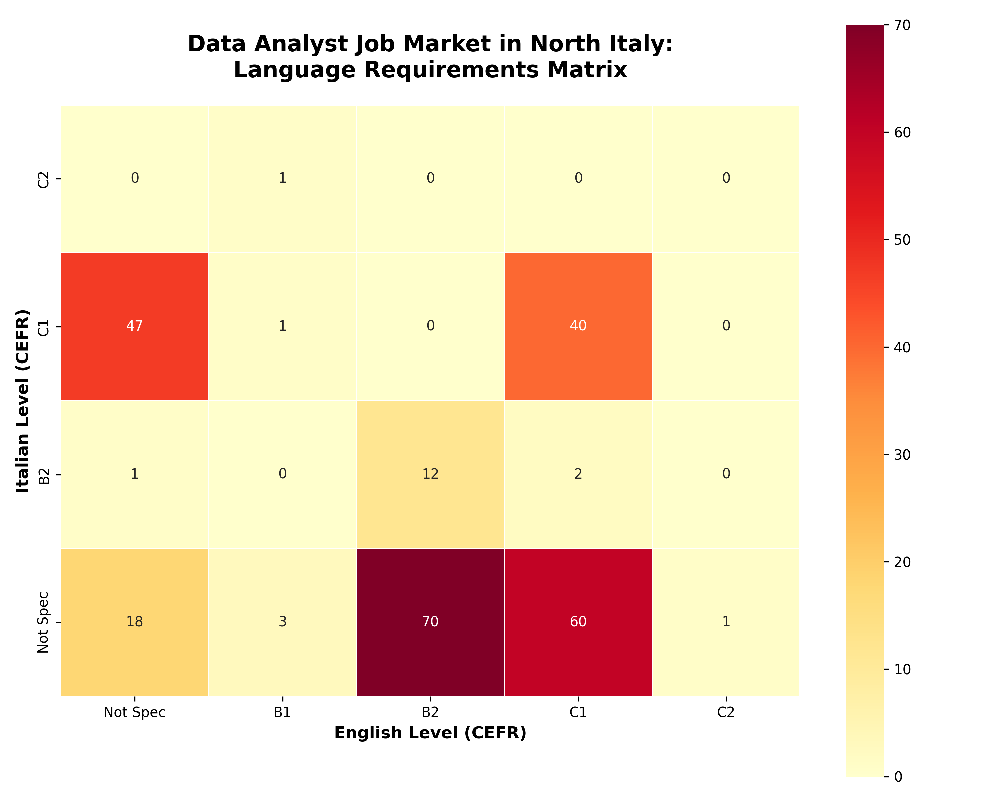
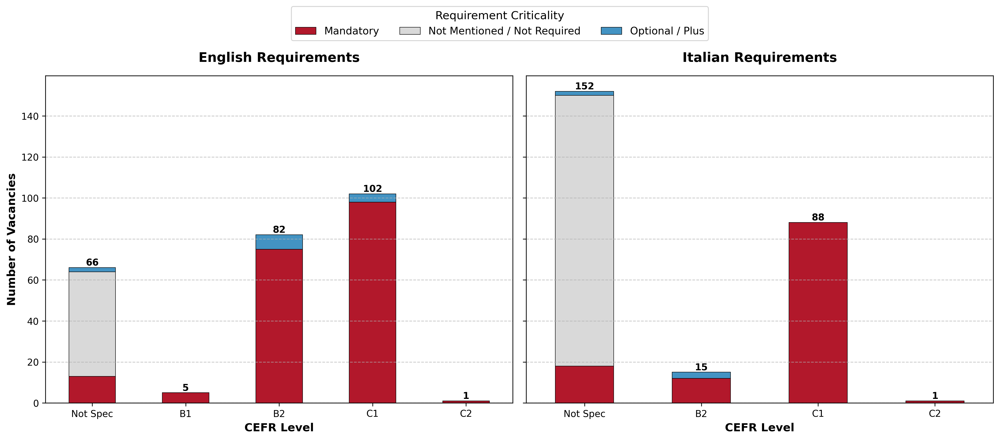

# North Italy Data Analyst Market: Language Barrier ETL Pipeline

## 📌 Project Overview
This project is a custom end-to-end ETL (Extract, Transform, Load) pipeline designed to collect, clean, and semantically analyze Data Analyst job postings in Northern Italy. The primary technical objective is to accurately parse complex, unstructured HR texts to extract specific language requirements (CEFR levels) and their criticality (Mandatory vs. Optional).

## 📊 Key Findings & Strategic Insights

### ❓ The Core Question
How important is the Italian language for employment as a Data Analyst in Northern Italy?

### 💡 Initial Hypothesis
> **The Language Trade-off:** If good English is required, you can compensate with a lower level of Italian.

### 📈 What the Data Says
The market does not support the trade-off hypothesis. It is strictly divided:




* **52.34% (134 vacancies):** English is required; Italian is not specified or not needed.
* **20.31% (52 vacancies):** High proficiency (B2 or C1) is required in **both** languages.
* **18.75% (48 vacancies):** Italian is required; English is not specified or not needed.

### 🎯 Actionable Conclusion
What should a candidate do to get a job in Northern Italy as a Data Analyst?

1. **Target the Majority:** You can apply to more than **52% of vacancies** with only entry-level Italian.
2. **Reevaluate ROI:** Studying Italian to a fluent level might not provide a high competitive advantage for these specific roles.
3. **Focus on Hard Skills:** Junior Data Analysts should prioritize improving their **technical and analytical skills** rather than mastering the Italian language.

## 🛠 Tech Stack
* **Data Extraction:** Python, Selenium (Remote Debugging)
* **Database:** SQLite3 (3NF Relational Architecture)
* **NLP & Text Processing:** Regular Expressions (`re`), `langdetect`
* **Data Manipulation & Visualization:** Pandas, Matplotlib, Seaborn

## ⚙️ Pipeline Architecture

The data pipeline consists of four distinct stages, executed sequentially:

### 1. Data Collection (`parser.py`)
* Connects to an active browser session via Remote Debugging to bypass automated scraping blocks.
* Extracts job titles, companies, locations, and full descriptions.
* Saves raw data into a relational SQLite database (`glassdoor_jobs.db`), ensuring data integrity with `UNIQUE` constraints and Foreign Keys.
* *Note: Salary data was intentionally excluded (Feature Selection) due to extreme sparsity in the European market.*

### 2. Semantic Parsing (`analyze_languages.py`)
* **Context Window Isolation:** Uses regex to capture 50-character windows around target keywords (English/Italian), strictly bounded by sentence ends to prevent data leakage between requirements.
* **Minimum Threshold Algorithm:** Maps textual requirements (e.g., "Fluent", "B2") to numeric CEFR ranks (1-6). If multiple levels are found, it extracts the minimum required level to prevent artificial barrier inflation.
* **Criticality Detection:** Classifies the requirement as `Mandatory` or `Plus (Optional)` based on specific negation and priority triggers.

### 3. Missing Data Imputation (`impute_languages.py`)
* Handles MNAR (Missing Not At Random) data where language requirements are not explicitly stated.
* Utilizes the `langdetect` library to analyze the language of the raw job description.
* Applies business logic: if a vacancy is written entirely in Italian but specifies no language requirements, Italian C1 is imputed as implicitly mandatory.

### 4. Data Visualization (`visualize_heatmap.py` & `visualize_status.py`)
* Connects to the processed SQLite database.
* Uses Pandas for data aggregation (`GROUP BY`, Cross-Tabulation).
* Generates static visual artifacts (Heatmaps and Stacked Bar Charts) to map market clusters and requirement strictness.

## 🚀 How to Run

Execute the pipeline in the following order:

```bash
# 1. Scrape raw data (requires active Chrome session on port 9222)
python parser.py

# 2. Extract explicit language requirements via Regex
python analyze_languages.py

# 3. Impute missing requirements via NLP
python impute_languages.py

# 4. Generate visualizations
python visualize_heatmap.py
python visualize_status.py